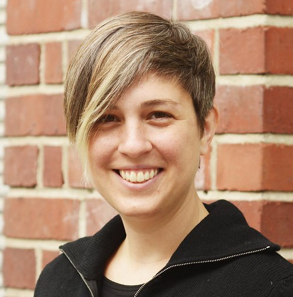

{:.about-paragraph}

I study how hearing people gesture while they speak, and how deaf people 
adapt many of these gestures for use as signs in young sign languages that are just now being created. 
My research is fieldwork-based and typological, comparing how gesturers and signers across cultures recruit 
the body for meaning-making, and focusing in particular on how people use the body to draw attention to their 
real-world surroundings. 

{:.about-paragraph}
Since 2012, I’ve worked with of UT Austin’s [Chatino Language Documentation Project (CLDP)](https://sites.google.com/site/lenguachatino/) to investigate how hearing and deaf people in one indigenous Chatino community use gestures of the hands and body to communicate. 

{:.about-paragraph}
Currently I am a postdoctoral researcher at the University of Haifa, studying the relationship of gesture and signed language as a member of the [Grammar of the Body](http://gramby.haifa.ac.il) research group.
