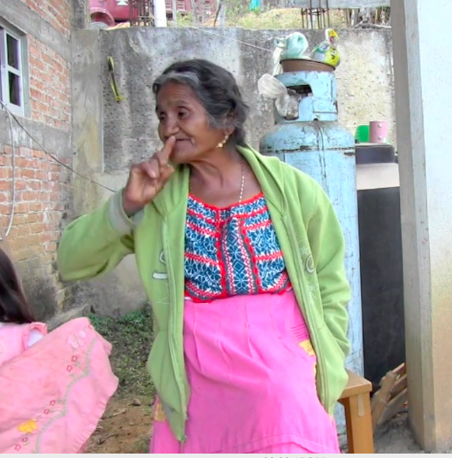
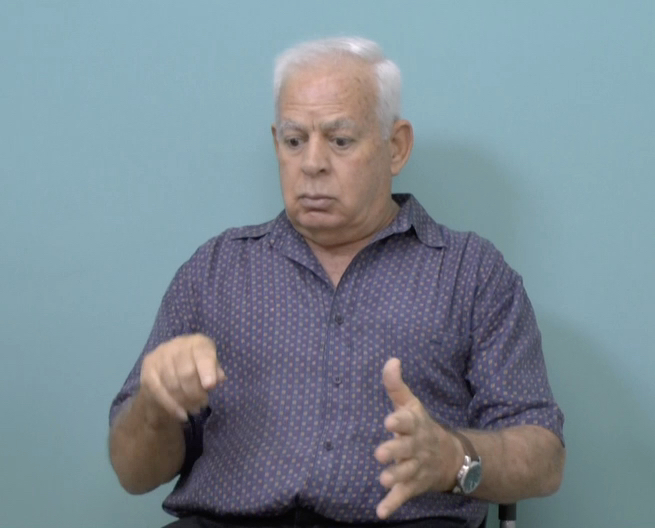

{:.about-paragraph}

I'm a linguist studying how hearing people gesture while they speak, and how deaf people 
adapt many of these gestures to use in young sign languages that are just now being created. 
My research is fieldwork-based and typological: I compare how gesturers and signers across cultures recruit 
the body for meaning-making, focusing on how people use the body to draw attention to their 
real-world surroundings. 

{:.about-paragraph}

Since 2012, I’ve worked with of UT Austin’s [Chatino Language Documentation Project (CLDP)](https://sites.google.com/site/lenguachatino/)
 to investigate how hearing and deaf people in one indigenous Chatino community use gestures of the hands and body to
 communicate. My dissertation documented the strategies hearing community members use when directing
  attention to items in the space around them. I made a direct comparison with the strategies of signers in the community, showing how
   signers have adapted the community’s pointing conventions to integrate them into their emerging language. 
 
 
{:.about-paragraph}

Currently I am a postdoctoral researcher at the University of Haifa, researching gesture 
 and signed language as a member of Wendy Sandler's [Grammar of the Body](http://gramby.haifa.ac.il)
research group. I lead a project comparing how Hebrew speakers and Israeli Sign Language (ISL) users employ gaze and manual pointing 
 with two functions: (i) to direct attention to items in the real space around them (locating), and (ii) to 
 maintain focus on characters who are introduced and described in complex narratives (reference tracking). 
 